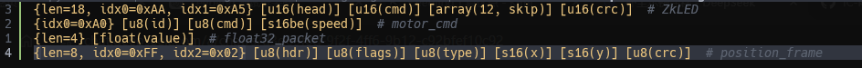
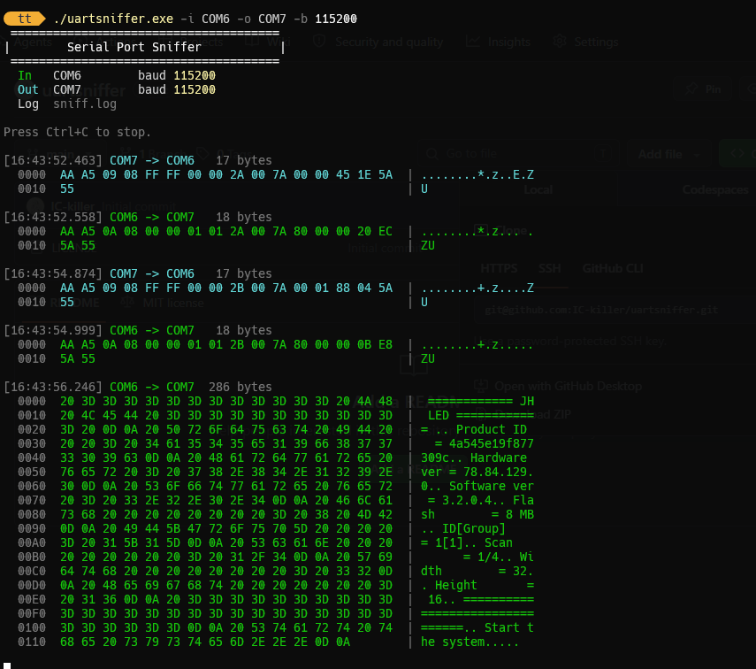
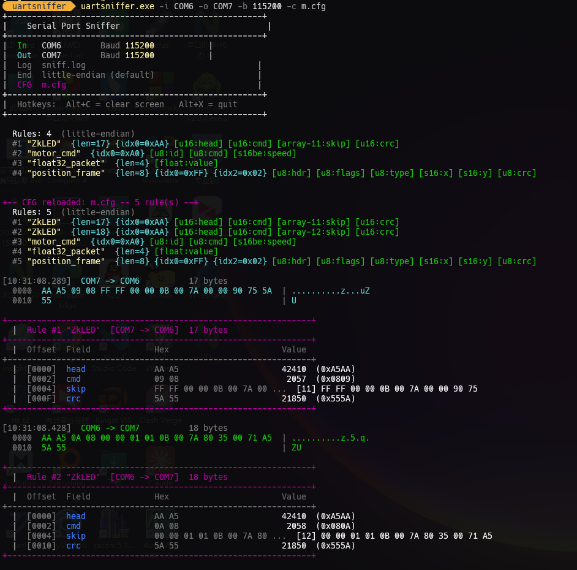

# uartsniffer

- 可以桥接两对虚拟串口，com0com或其他虚拟串口工具生成的都可以.
  - 监听原理: 串口对AB，串口对CD，用AC连接上位机, 用uartsniffer桥接BD, 即获取到收发数据
- 可以作为两个物理串口的串口桥, 桥接物理串口到虚拟串口等。
- 利用一对虚拟串口，可以作为其他串口助手的外挂解码器使用
- 灵活简单的解析器规则，按数据类型大小逐字节消费数据包, 支持数据类型用户标签，支持全局和指定大小端配置
- 支持解析过滤器, 支持指定数据包长度，支持指定特定索引字节数据，支持多条件组合(AND逻辑)。
- 配置文件支持热重载
- 支持log记录
- 跨平台，待测试

> 注意：串口缓冲区大小为1KB硬编码

## 编译

- make all

## 使用

- cli监听：`./uartsniffer.exe -i COM6 -o COM7 -b 115200`
- cli指定解析配置监听：`sniffer.exe -i COM6 -o COM7 -b 115200 -c e.cfg`
  - 配置文件需要在可执行程序路径或指定绝对路径
  - 如下表示4条解析规则的配置示例：
    
  - `e.cfg`为协议解析器的示例配置,支持`#`注释

普通监听：

指定解析器配置监听:

**设计思路：**

- `{...}` 过滤条件：`len=N`、`idx3=0x05`、可组合（AND逻辑）
- `[type(label)]` 解析字段：按顺序消耗字节, label解析注解
- 多行规则
- 解析配置支持热重载
- 支持全局和解析段的大小端配置
- 支持波特率配置，串口参数8N1
- 使用`./uartsniffer.exe -h` 查看详细帮助

**`-c` 解析器配置文件语法规则：**

| 语法 | 说明 |
|------|------|
| `{len=9}` | 包长度必须为 9 字节 |
| `{idx0=0x01}` | 第 0 字节必须为 0x01 |
| `{len=9, idx0=0x01, idx2=0x05}` | 多条件 AND 组合 |
| `[u16(voltage)]` | 解析 2 字节 LE uint16，标签为 voltage |
| `[s16be(speed)]` | 解析 2 字节 BE int16 |
| `[s16be(speed)]` | 解析 2 字节 BE int16 |
| `[array-12(string)]` | 一个长12的数组 |
| `# rule_name` | 行末注释作为规则名称显示 |

**支持的数据类型：** `u8 s8 u16 s16 u16be s16be u32 s32 u32be s32be float double array`
